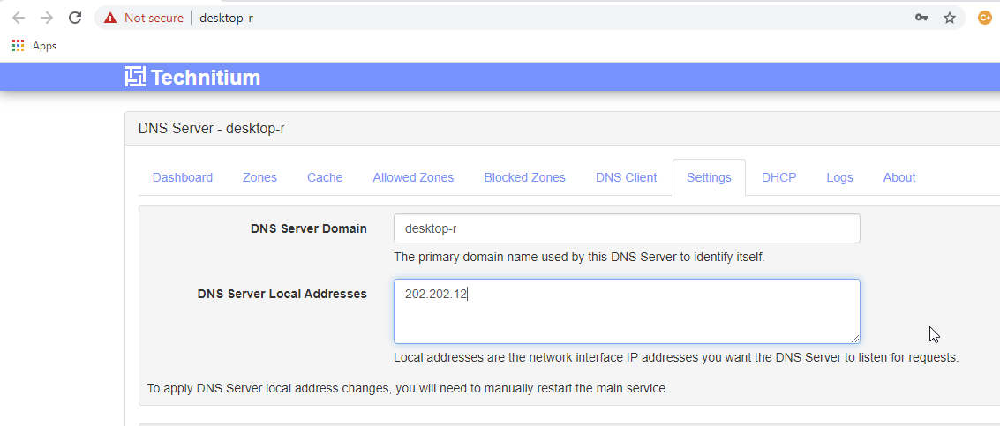
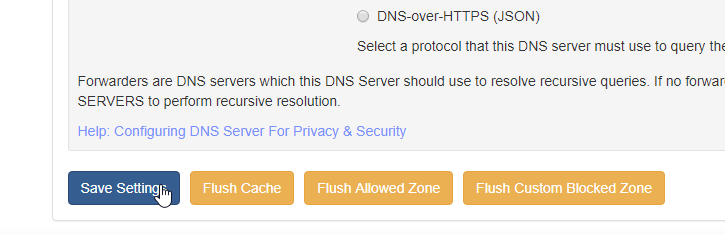

## Installation
- **Windows**: [Download setup installer](https://download.technitium.com/dns/DnsServerSetup.zip) for easy installation.
- **Linux & Raspberry Pi**: Follow install instructions from [this blog post](https://blog.technitium.com/2017/11/running-dns-server-on-ubuntu-linux.html).
- **Cross-Platform**: [Download portable app](https://download.technitium.com/dns/DnsServerPortable.tar.gz) to run on any platform that has .NET Core installed.

### Ubuntu installation instructions
```
curl -sSL https://download.technitium.com/dns/install.sh | sudo bash
```
### Ubuntu configuration instructions
There is an API that allows configuring technitium and it is documented here:https://github.com/TechnitiumSoftware/DnsServer/blob/master/APIDOCS.md this will be used  to add a zone:


### Ubuntu uninstallation instructions
```
curl -sSL https://download.technitium.com/dns/uninstall.sh | sudo bash
```


## Example hosting for hosting your own website
Besides all the amazing features, Technitium can also be used for (at least the following) 2 scenarios:

  0. You want to redirect website to a an ip of a different website, e.g. www.wastingTheTimeOfYourLife.com to www.qualitativeInformationEnhancingTheTimeOfYourAndOthersLife.com
  1. If you bought/aqcuired a domain and want to show your website on it by yourself.

So for example **suppose you bought www.google.com and you have made a beautifull website (on your pc) that you want to show when people visit google.com**

 0. Install technitium dns server (or download the portable version)
 1. Run `DnsServerApp.exe`
 2. Open a browser and browse to the local host adress that the `DnsServerApp.exe` gives you. E.g. `http://desktop-234asfdn2:5380/`.
 3. Go to the tab: `Zones`.
 4. Click on `Add Zone`
	
 5. and enter `google.com`
 
	
 6. Then click on "Add record", 
	
 7. select Type:`A` and at the IP adress type the PUBLIC IP address of your pc. (The PUBLIC IP adress is what you see when you visit: www.whatsmyip.org, e.g. 202.202.12)
	
 8. Now you're already done, but it only works if people visit google.com and not `www.google.com`. So:
 9. Again, click "Add record"
 
	
 10. at Name enter:`www`
 11. at Type select:`CNAME`
 12. at Domain Name type:`google.com`
 


 13. Now Technitium/your DNS server forwards `www` to `google.com` and then redirects `google.com` to your ip, meaning people see your website :)
 
 21. Then just ensure the following settings are in, where I replaced `google.com` with `hiveminds.eu`, as though I own the domain `hiveminds.eu` In short your put these settings in your technitium settings panel, (replace the `your ip` with the public ip adress of your computer/host/the device you host your website on. (The `A` `ns1.<yourwebsite>` `<your public ip adress> is a glue record that tells the computer that links people to your website , hey when you are looking for this hostname/website, you can look at this ip to find the hostname/website, (But then it would get in an infinte loop so you tell it ok stop here, you found the website at this ip.)


 22. Also, in the Technitium settings, click `Settings` tab. And fill in your personal ipv4 adress, in this example I assumed `202.202.12`, in at `DNS Server Local Addresses`. 



 23. Then go the bottom of the settings page/tab and click:`save settings`. (I also clicked `flush cache` but haven't tested whether it is required.) 



24. Then close the `DnsServerApp.exe` and restart it.

## Verified settings to host your own dns server:
 You can now verify you indeed redirect `www.google.com` to your computer, to do so: 
 
 14. Get the public ip adress of your computer, (for this example I'll use 202.202.12).
 15. Open Powershell
 16. Type: nslookup www.google.com
 17. That should return the ip adress of google (veriy it does, by copying the adress it returns and entering it in your browser {at the time of writing it was `172.217.19.196`)).
 18. Now type: `nslookup www.google.com <your ip adress>`
 19. So in this example that would be:`nslookup www.google.com 202.202.12`
 


 20. That should regurn the ip adress that you entered at step 6 (in steps 10 to 15 of this example it was `234.54.231.1)`.
 


 22. Then create the custom dns record in your domain registrar, this is done different for every domain seller. This is the example for namecheap. In short you want to type your your dns server hostname (if you put `ns1.<yourwebsite adres>` in the technitium enter that, together with the public ip adress of your computer. 


 23. You can inspect your dns server/glue record to ip is entered correctly by searching: `ns1` or `ns2` (if you entered `ns1.<yourwebsite>`:


 24. Don't forget to also select your own custom dns in the website settings, otherwise you have configured everything correctly in your local dns server, and told the registrar hey at custom dns, look at this ip for my own dns server, but then in the end the registrar still looks in its own default dns server, (where it won't find your ip, you need to pay for that).


